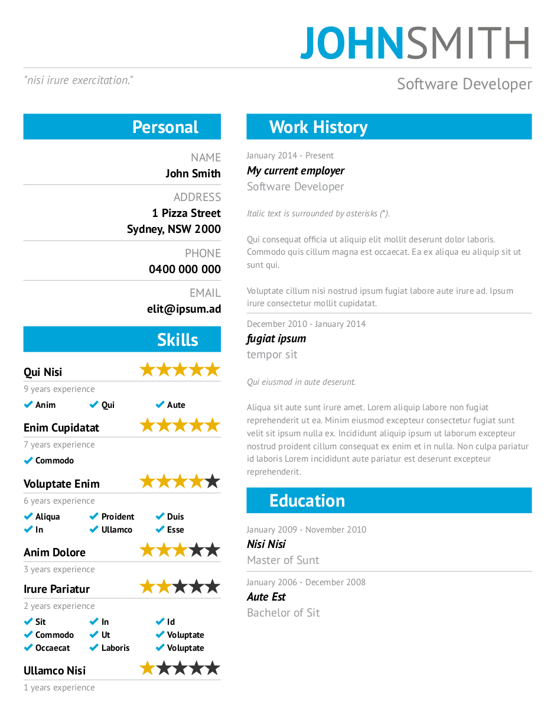

# my-resume
A nifty web tool to help generate and maintain my resume (prints well to PDF).

It stores all information in base64 then adds it to the page's hash so you can "functionally" bookmark it.



## Usage
This tool runs on JSON and at a minimum requires the following "schema":

```
{
  "resume": {
    "firstName": str,
    "lastName": str,
    "role": str,
    "blurb": str,
    "work": [
      {
        "startDate": str,
        "endDate": str,
        "name": str,
        "role": str,
        "text": [
          str,
          ...
        ]
      },
      ...
    ],
    "personal": [
      {
        "field": str,
        "text": [
          str,
          ...
        ]
      },
      ...
    ],
    "skills": [
      {
        "field": str,
        "stars": int [1-5],
        "started": str [yyyy],
        "subskills": [
          str,
          ...
        ]
      },
      ...
    ],
    "education": [
      {
        "startDate": str,
        "endDate": str,
        "name": str,
        "degree": str
      },
      ...
    ]
  }
}
```

For example:

```
{
  "resume": {
    "firstName": "FIRST",
    "lastName": "LAST",
    "role": "MYROLE",
    "blurb": "\"MY BLURB\"",
    "work": [
      {
        "startDate": "START",
        "endDate": "END",
        "name": "COMPANY LTD",
        "role": "MY ROLE",
        "text": [
          "*Italic paragraph.*",
          "Normal paragraph."
        ]
      }
    ],
    "personal": [
      {
        "field": "NAME",
        "text": [
          "First Last"
        ]
      }
    ],
    "skills": [
      {
        "field": "Skill",
        "stars": 5,
        "started": 2009,
        "subskills": [
          "Subskill"
        ]
      }
    ],
    "education": [
      {
        "startDate": "2012",
        "endDate": "2016",
        "name": "University",
        "degree": "Degree Name"
      }
    ]
  }
}
```

## Priting PDF
This should render and print well in the lastest Chrome/Chromium. You may need to scale it down ever so slightly and enable background graphics.

## Building

```
$ yarn install && yarn run build
```

## Deploying

```
$ yarn run deploy
```

## License
This tool is licensed under MIT. Credit would be nice but not necessary.
